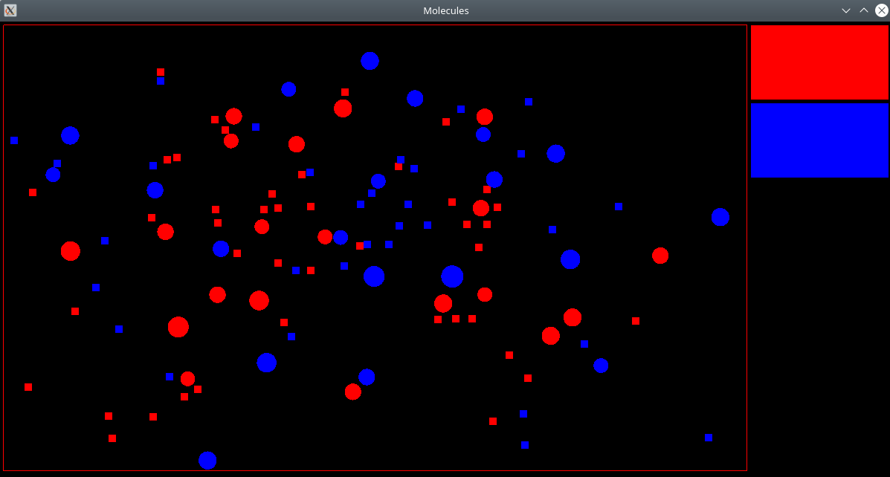

# Modeling the movement of particles in bounding box



Modeling the movement of particles with charge (Coulomb forces are taken into account). When particles collide, they turn into each other. You can add particles using buttons.

build & run:
```
mkdir build
cd build
cmake ..
make balls
./balls
```